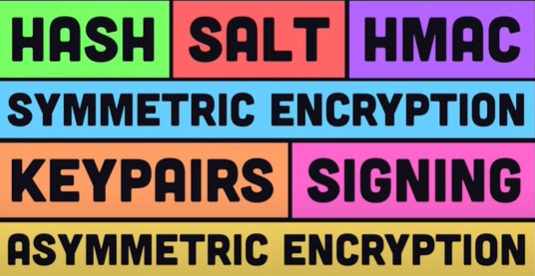

# Learn Security

## Concepts

- Hash
- Salt
- Hmac
- Symmetric Encryption
- Asymmetric Encryption
- Digital Signature

## Security Services

### Message Confidentiality

To achieve message confidentiality we can either use symmetric-key or asymmetric-key cryptography.

For long messages symmetric-key cryptography is much more efficient than the asymmetric-key cryptography. Mostly only for the symmetric key exchange we use asymmetric key cryptography.

### Message Integrity

To achieve message integrity we can use hash function to create a compressed image of the message. So the receiver can create the hash again of the message and compare it with the received hash to check if there is any change in the message.

### Message Authentication

Two methods to achieve message authentication.

1. Use keyed hash function to create a message digest which is also known as HMAC(Hash Message Authentication Code).
2. Use Digital Signature which is internally using asymmetric key cryptography.

### Message Nonrepudiation
